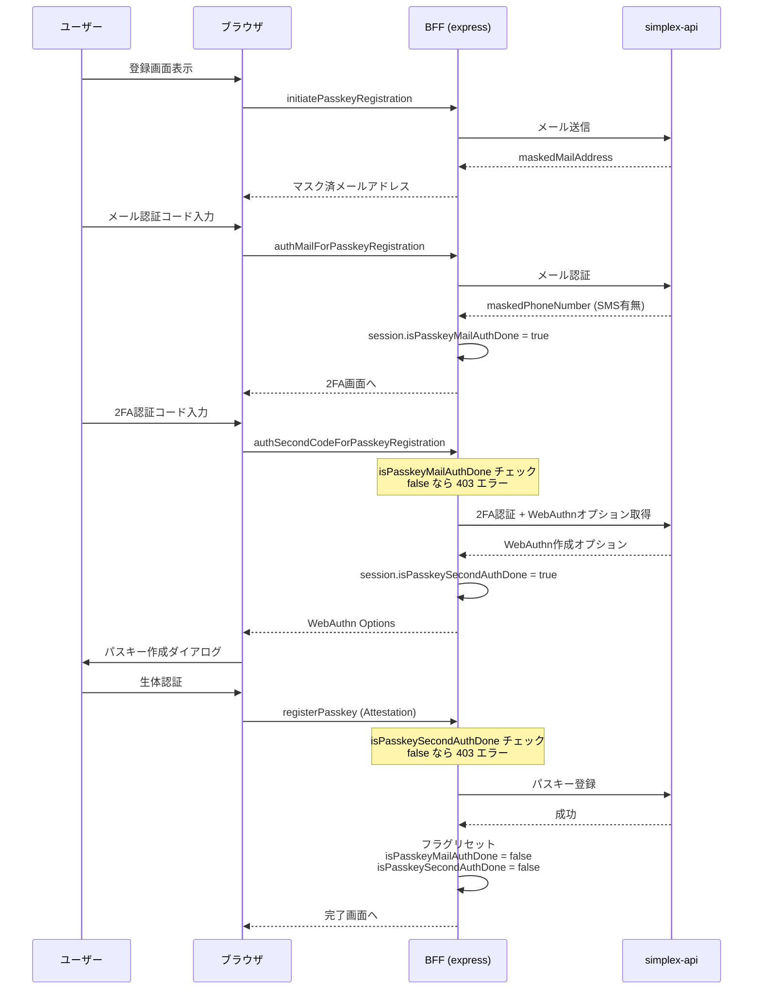
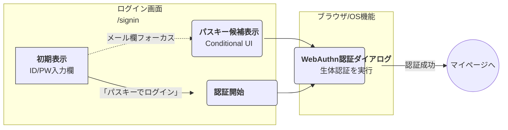
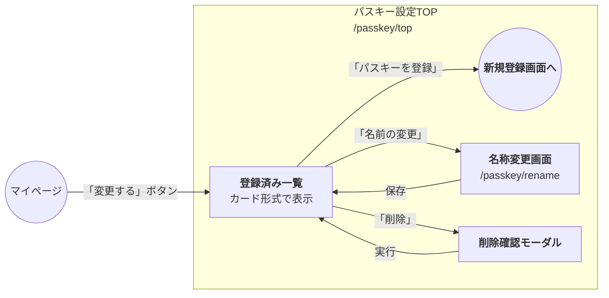
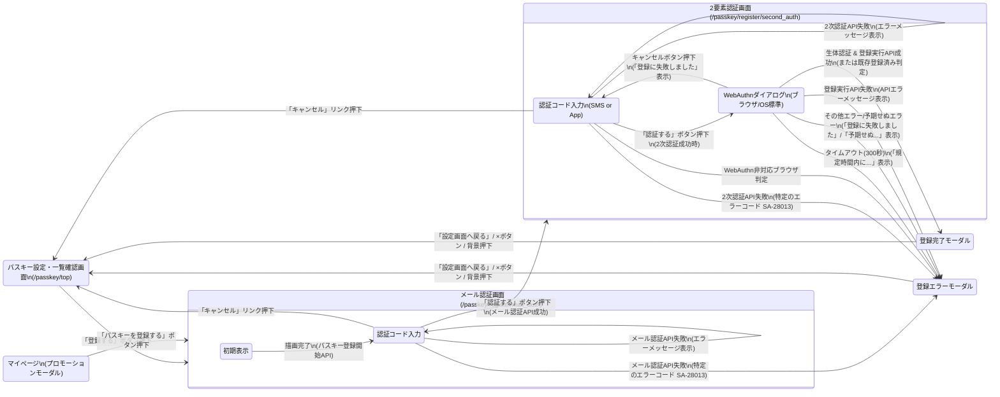

```mermaid
sequenceDiagram
    participant User as ユーザー
    participant Browser as ブラウザ
    participant BFF as BFF (express)
    participant API as simplex-api

    User->>Browser: 登録画面表示
    Browser->>BFF: initiatePasskeyRegistration
    BFF->>API: メール送信
    API-->>BFF: maskedMailAddress
    BFF-->>Browser: マスク済メールアドレス

    User->>Browser: メール認証コード入力
    Browser->>BFF: authMailForPasskeyRegistration
    BFF->>API: メール認証
    API-->>BFF: maskedPhoneNumber (SMS有無)
    BFF->>BFF: session.isPasskeyMailAuthDone = true
    BFF-->>Browser: 2FA画面へ

    User->>Browser: 2FA認証コード入力
    Browser->>BFF: authSecondCodeForPasskeyRegistration
    Note over BFF: isPasskeyMailAuthDone チェック<br/>false なら 403 エラー
    BFF->>API: 2FA認証 + WebAuthnオプション取得
    API-->>BFF: WebAuthn作成オプション
    BFF->>BFF: session.isPasskeySecondAuthDone = true
    BFF-->>Browser: WebAuthn Options

    Browser->>User: パスキー作成ダイアログ
    User->>Browser: 生体認証
    Browser->>BFF: registerPasskey (Attestation)
    Note over BFF: isPasskeySecondAuthDone チェック<br/>false なら 403 エラー
    BFF->>API: パスキー登録
    API-->>BFF: 成功
    BFF->>BFF: フラグリセット<br/>isPasskeyMailAuthDone = false<br/>isPasskeySecondAuthDone = false
    BFF-->>Browser: 完了画面へ
```

```mermaid

graph LR
    %% 幅固定スタイル
    classDef box  , text-align:center, stroke:#333, stroke-width:1px;
    classDef oval width:150px, text-align:center , stroke:#333, stroke-width:1px;

    subgraph LoginScreen ["ログイン画面 <br> /signin"]
        Init[<b>初期表示</b><br>ID/PW入力欄]:::box
        
        Init -.->|メール欄フォーカス| AutoFill(<b>パスキー候補表示</b><br>Conditional UI):::oval
        Init -->|「パスキーでログイン」| Manual(<b>認証開始</b>):::oval
    end

    subgraph Browser ["ブラウザ/OS機能"]
        AutoFill --> OS_Auth(<b>WebAuthn認証ダイアログ</b><br>生体認証を実行):::oval
        Manual --> OS_Auth
    end

    OS_Auth -->|認証成功| MyPage((マイページへ))
```

```mermaid
graph LR
    MyPage((マイページ)) -->|「変更する」ボタン| Top
    
    %% subgraph ID ["タイトル"] の形式にします
    subgraph PasskeyGroup ["パスキー設定TOP <br> /passkey/top"]
        Top[<b>登録済み一覧</b><br>カード形式で表示]
        
        Top -->|「パスキーを登録」| Register((<b>新規登録画面へ</b>))
        Top -->|「名前の変更」| Rename[<b>名称変更画面</b><br>/passkey/rename]
        Top -->|「削除」| Delete[<b>削除確認モーダル</b>]
    end

    Rename -->|保存| Top
    Delete -->|実行| Top
```

```mermaid
stateDiagram-v2
    direction LR

    %% エントリーポイント
    state "パスキー設定・一覧確認画面\n(/passkey/top)" as TopPage
    state "マイページ\n(プロモーションモーダル)" as MyPagePromo

    %% メール認証画面
    state "メール認証画面\n(/passkey/register/mail_auth)" as MailAuthPage {
        state "初期表示" as MailInit
        state "認証コード入力" as MailInput
        
        MailInit --> MailInput : 描画完了\n(パスキー登録開始API)
    }

    %% 2要素認証画面
    state "2要素認証画面\n(/passkey/register/second_auth)" as SecondAuthPage {
        state "認証コード入力\n(SMS or App)" as SecondAuthInput
        state "WebAuthnダイアログ\n(ブラウザ/OS標準)" as WebAuthnDialog
        
        SecondAuthInput --> WebAuthnDialog : 「認証する」ボタン押下\n(2次認証成功時)
    }

    %% モーダル（完了・エラー）
    state "登録完了モーダル" as SuccessModal
    state "登録エラーモーダル" as ErrorModal

    %% 遷移フロー
    TopPage --> MailAuthPage : 「登録する」ボタン押下
    MyPagePromo --> MailAuthPage : 「パスキーを登録する」ボタン押下

    %% Step 1: メール認証
    MailInput --> SecondAuthPage : 「認証する」ボタン押下\n(メール認証API成功)
    MailInput --> MailInput : メール認証API失敗\n(エラーメッセージ表示)
    MailInput --> ErrorModal : メール認証API失敗\n(特定のエラーコード SA-28013)
    MailInput --> TopPage : 「キャンセル」リンク押下

    %% Step 2: 2要素認証 & パスキー作成
    SecondAuthInput --> SecondAuthInput : 2次認証API失敗\n(エラーメッセージ表示)
    SecondAuthInput --> ErrorModal : 2次認証API失敗\n(特定のエラーコード SA-28013)
    SecondAuthInput --> ErrorModal : WebAuthn非対応ブラウザ判定
    SecondAuthInput --> TopPage : 「キャンセル」リンク押下

    %% Step 3: WebAuthn & 登録実行
    WebAuthnDialog --> SuccessModal : 生体認証 & 登録実行API成功\n(または既存登録済み判定)
    WebAuthnDialog --> SecondAuthInput : キャンセルボタン押下\n(「登録に失敗しました」表示)
    WebAuthnDialog --> ErrorModal : タイムアウト(300秒)\n(「規定時間内に...」表示)
    WebAuthnDialog --> ErrorModal : その他エラー/予期せぬエラー\n(「登録に失敗しました」/「予期せぬ...」表示)
    WebAuthnDialog --> ErrorModal : 登録実行API失敗\n(APIエラーメッセージ表示)

    %% 完了後の遷移
    SuccessModal --> TopPage : 「設定画面へ戻る」/ ×ボタン / 背景押下
    ErrorModal --> TopPage : 「設定画面へ戻る」/ ×ボタン / 背景押下
```
