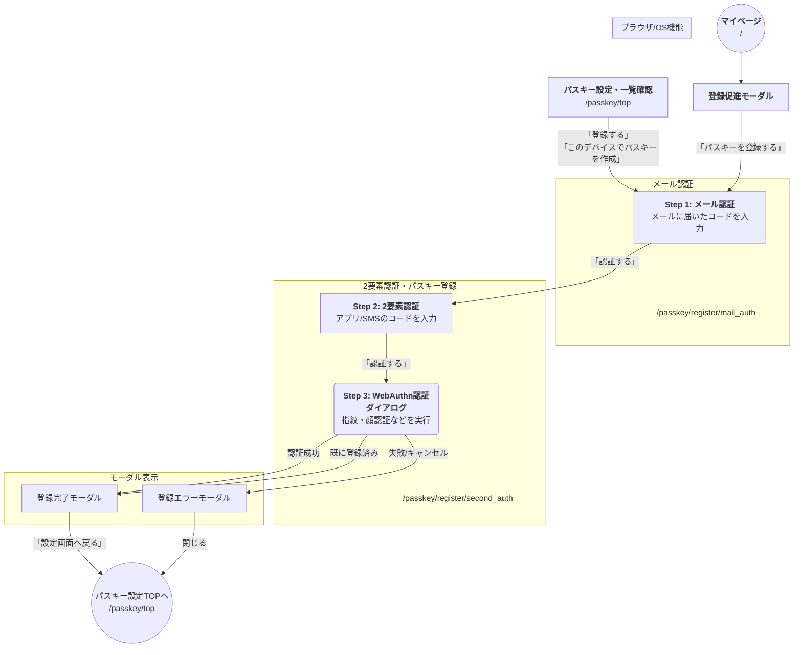
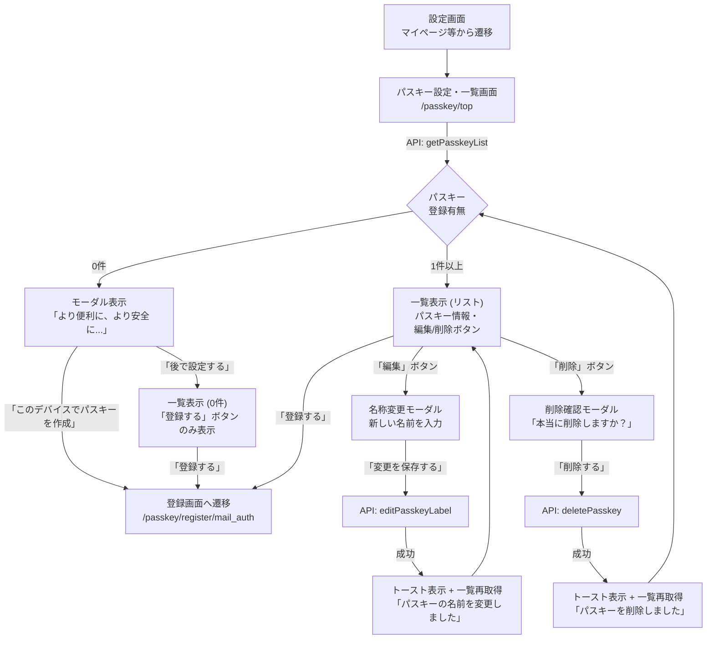

```mermaid
graph 

    %% --- スタイルの定義 ---
    classDef box  white-space:normal, text-align:center, stroke-width:1px, min-width:150px;
    classDef oval  white-space:normal, text-align:center,  stroke-width:1px, min-width:150px;
    classDef urlLabel fill:none, stroke:none

    %% --- 入り口 ---
    Entry_Top[<b>パスキー設定・一覧確認</b><br>/passkey/top]:::box
    Entry_MyPage((<b>マイページ</b><br>/))
    Entry_MyPage --> PromoModal[<b>登録促進モーダル</b>]:::box

    Entry_Top -->|「登録する」<br>「このデバイスでパスキーを作成」| Step1
    PromoModal -->|「パスキーを登録する」| Step1
    
    %% --- 画面1 ---
    subgraph Page_MailAuth ["メール認証"]
        direction TB
        Step1[<b>Step 1: メール認証</b><br>メールに届いたコードを入力]:::box
        
        %% 下部にURL用の透明ノードを配置
        Url1["/passkey/register/mail_auth"]:::urlLabel
        %% 見えない線でつなぐ
        Step1 ~~~ Url1
    end

    Step1 -->|「認証する」| Step2

    %% --- 画面2 ---
    subgraph Page_SecondAuth ["2要素認証・パスキー登録"]
        direction TB
        Step2[<b>Step 2: 2要素認証</b><br>アプリ/SMSのコードを入力]:::box
        Step2 -->|「認証する」| OS_Auth
        
        %% 下部にURL用の透明ノードを配置
        Url2["/passkey/register/second_auth"]:::urlLabel
        %% 見えない線でつなぐ
        OS_Auth ~~~ Url2
    end

    %% --- ブラウザ機能 ---
    subgraph Browser ["ブラウザ/OS機能"]
        direction TB
        OS_Auth(<b>Step 3: WebAuthn認証<br>ダイアログ</b><br>指紋・顔認証などを実行):::oval
    end

    OS_Auth -->|認証成功| Complete
    OS_Auth -->|既に登録済み| Complete
    OS_Auth -->|失敗/キャンセル| ErrorModal

    %% --- 完了モーダル ---
    subgraph Modal_View ["モーダル表示"]
        direction TB
        Complete[登録完了モーダル]:::box
        ErrorModal[登録エラーモーダル]:::box
    end

    Complete -->|「設定画面へ戻る」| End((パスキー設定TOPへ<br>/passkey/top))
    ErrorModal -->|閉じる| End
```

```mermaid
graph TD
    %% スタイルの定義
    classDef box  white-space:normal, text-align:center, stroke-width:1px;
    classDef oval  white-space:normal, text-align:center,  stroke-width:1px;

    %% --- エントリー ---
    Entry["設定画面<br>マイページ等から遷移"]:::box
    Entry --> Load["パスキー設定・一覧画面<br>/passkey/top"]:::box

    %% --- データ取得と分岐 ---
    Load -->|API: getPasskeyList| CheckCount{"パスキー<br>登録有無"}

    %% --- 0件の場合 ---
    CheckCount -->|"0件"| ZeroModal["モーダル表示<br>「より便利に、より安全に...」"]:::box
    ZeroModal -->|"「このデバイスでパスキーを作成」"| RegisterPage["登録画面へ遷移<br>/passkey/register/mail_auth"]:::box
    
    %% 【修正箇所】ここでダブルクォーテーションを追加しました
    ZeroModal -->|"「後で設定する」"| ZeroView["一覧表示 (0件)<br>「登録する」ボタン<br>のみ表示"]:::box
    
    ZeroView -->|"「登録する」"| RegisterPage

    %% --- 1件以上の場合 ---
    CheckCount -->|"1件以上"| ListView["一覧表示 (リスト)<br>パスキー情報・<br>編集/削除ボタン"]:::box
    ListView -->|"「登録する」"| RegisterPage

    %% --- 編集フロー ---
    ListView -->|"「編集」ボタン"| EditModal["名称変更モーダル<br>新しい名前を入力"]:::box
    EditModal -->|"「変更を保存する」"| ApiEdit["API: editPasskeyLabel"]:::oval
    ApiEdit -->|成功| ToastEdit["トースト表示 + 一覧再取得<br>「パスキーの名前を変更しました」"]:::box
    ToastEdit --> ListView

    %% --- 削除フロー ---
    ListView -->|"「削除」ボタン"| DeleteModal["削除確認モーダル<br>「本当に削除しますか？」"]:::box
    DeleteModal -->|"「削除する」"| ApiDelete["API: deletePasskey"]:::oval
    ApiDelete -->|成功| ToastDelete["トースト表示 + 一覧再取得<br>「パスキーを削除しました」"]:::box
    ToastDelete --> CheckCount
```