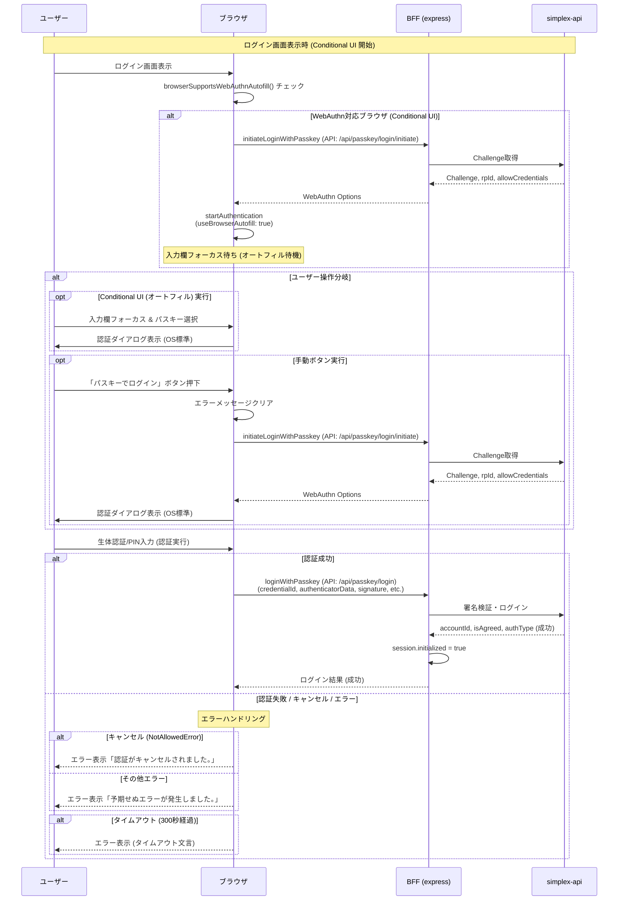

```mermaid
sequenceDiagram
    participant User as ユーザー
    participant Browser as ブラウザ
    participant BFF as BFF (express)
    participant API as simplex-api

    Note over User, API: ログイン画面表示時 (Conditional UI 開始)

    User->>Browser: ログイン画面表示
    Browser->>Browser: browserSupportsWebAuthnAutofill() チェック

    alt WebAuthn対応ブラウザ (Conditional UI)
        Browser->>BFF: initiateLoginWithPasskey (API: /api/passkey/login/initiate)
        BFF->>API: Challenge取得
        API-->>BFF: Challenge, rpId, allowCredentials
        BFF-->>Browser: WebAuthn Options

        Browser->>Browser: startAuthentication<br/>(useBrowserAutofill: true)
        Note over Browser: 入力欄フォーカス待ち (オートフィル待機)
    end

    alt ユーザー操作分岐
        
        opt Conditional UI (オートフィル) 実行
            User->>Browser: 入力欄フォーカス & パスキー選択
            Browser->>User: 認証ダイアログ表示 (OS標準)
        end

        opt 手動ボタン実行
            User->>Browser: 「パスキーでログイン」ボタン押下
            Browser->>Browser: エラーメッセージクリア
            Browser->>BFF: initiateLoginWithPasskey (API: /api/passkey/login/initiate)
            BFF->>API: Challenge取得
            API-->>BFF: Challenge, rpId, allowCredentials
            BFF-->>Browser: WebAuthn Options
            Browser->>User: 認証ダイアログ表示 (OS標準)
        end
    end

    User->>Browser: 生体認証/PIN入力 (認証実行)

    alt 認証成功
        Browser->>BFF: loginWithPasskey (API: /api/passkey/login)<br/>(credentialId, authenticatorData, signature, etc.)
        BFF->>API: 署名検証・ログイン
        API-->>BFF: accountId, isAgreed, authType (成功)
        BFF->>BFF: session.initialized = true
        BFF-->>Browser: ログイン結果 (成功)

    else 認証失敗 / キャンセル / エラー
        Note over Browser: エラーハンドリング
        alt キャンセル (NotAllowedError)
            Browser-->>User: エラー表示「認証がキャンセルされました。」
        else その他エラー
            Browser-->>User: エラー表示「予期せぬエラーが発生しました。」
        end
        alt タイムアウト (300秒経過)
            Browser-->>User: エラー表示 (タイムアウト文言)
        end
    end
```