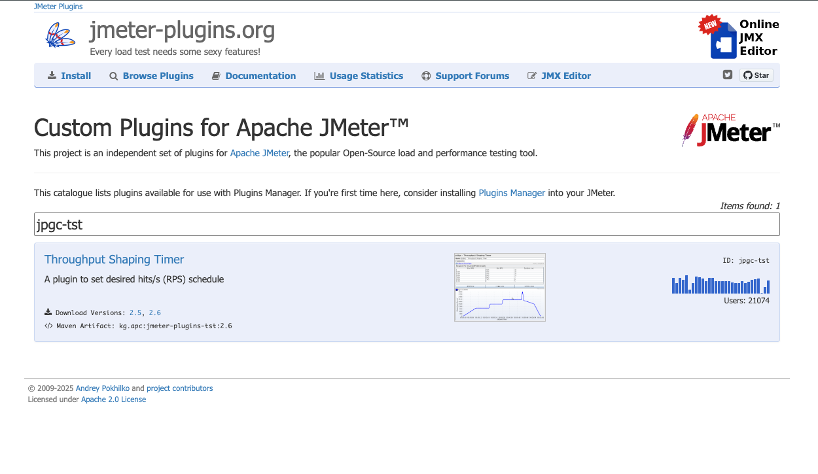
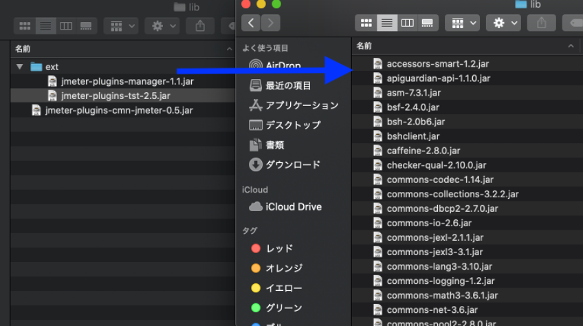
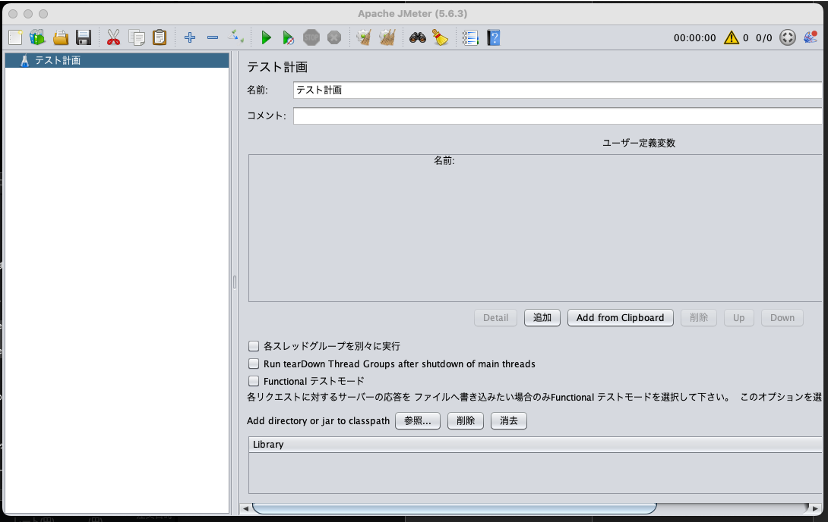

# JMeterシナリオ作成・実行手順書

## 1. はじめに
本ドキュメントは、負荷試験におけるJMeterのセットアップ、シナリオ作成、および実行手順をまとめたものである。

## 2. 環境構築 (Setup)
### 2-1. インストール
1. **Javaのインストール**
   JMeterの実行にはJava環境（JDK）が必要である。未導入の場合はインストールする。

2. **JMeterのインストール**
   ターミナルで以下のコマンドを実行する。
```
brew install jmeter
```
3. **日本語環境の設定（恒久対応）**
    起動スクリプトを直接編集せず、ユーザー設定ファイル(user.properties)に追記することで、JMeterのアップデート時にも設定を維持させる。
```
cd $(brew --prefix jmeter)/libexec/bin
```

4. user.propertiesに言語設定を追加する
```properties
# 修正前
"${JMETER_LANGUAGE:=-Duser.language=en -Duser.region=EN}"

# 修正後（日本語化）
"${JMETER_LANGUAGE:=-Duser.language=ja -Duser.region=JP}"
```

### 2-2. プラグインの導入
1. [Throughput Shaping Timer ダウンロードページ](https://jmeter-plugins.org/?search=jpgc-tst)へアクセスし、最新のzipファイルをダウンロードする。
   

2. ダウンロードしたファイルを解凍し、必要な `.jar` ファイルを確認する。
   * `jmeter-plugins-cmn-jmeter-x.x.jar`
   * `ext/jmeter-plugins-manager-x.x.jar`
   * `ext/jmeter-plugins-tst-x.x.jar`

3. **ライブラリの配置**
   解凍したフォルダ内でターミナルを開き、以下のコマンドで配置する（手動コピーより確実である）。

```bash
# 現在のディレクトリからJMeterのlibフォルダへコピー
# ※カレントディレクトリが解凍したフォルダであることを前提とする
cp *.jar $(brew --prefix jmeter)/libexec/lib/
cp ext/*.jar $(brew --prefix jmeter)/libexec/lib/ext/
```


4. **起動確認**
   JMeterを起動し、日本語化されていること、およびプラグインが認識されていることを確認する。

```bash
jmeter
```


5. **GUI設定**
   メニューバー `オプション` → `ルック＆フィール` から任意のデザインに変更する。
   > **Note:** コピー&ペーストの動作安定性のため、**System** の選択を推奨する。

## 3. シナリオ作成 (Scenario Design)
### 3-1. プロキシレコーディング
### 3-2. 動的パラメータの相関 (Correlation)
### 3-3. アサーション設定

## 4. テスト実行 (Execution)
### 4-1. GUIでのデバッグ
### 4-2. CLIでの負荷試験実行