# JMeterシナリオ作成・実行手順書

## 目次
1. [はじめに](#1-はじめに)
2. [環境構築 (Setup)](#2-環境構築-setup)
3. [シナリオ作成 (Scenario Design)](#3-シナリオ作成-scenario-design)
4. [負荷試験設定 (Load Configuration)](#4-負荷試験設定-load-configuration)
5. [テスト実行 (Execution)](#5-テスト実行-execution)
6. [レポート解析 (Result Analysis)](#6-レポート解析-result-analysis)
7. [Appendix A. プロキシとHTTPS証明書の設定詳細](#appendix-a-プロキシとhttps証明書の設定詳細)
8. [Appendix B. メール取得機能 (Mail Reader Sampler)](#appendix-b-メール取得機能-mail-reader-sampler)

## 1. はじめに
本ドキュメントは、負荷試験におけるJMeterのセットアップ、シナリオ作成、および実行手順をまとめたものである。

### 1-1. JMeter概要
Apache JMeterは、Webアプリケーション等のパフォーマンス測定と負荷テストを行うためのオープンソースソフトウェア（Java製）である。

* **主な機能:**
    * **負荷生成:** 静的・動的なリソース（Web, API, DB等）に対し、大量の同時アクセスをシミュレートする。
    * **性能測定:** スループット（RPS）、応答時間（Latency）、エラー率などを計測する。
    * **拡張性:** プラグインにより、機能やグラフ表示を拡張可能。

### 1-2. 負荷試験のゴール設定 (SLO/SLA)
シナリオ作成を開始する前に、必ず「何をもって試験合格とするか」を定量的に定義する。
各プロジェクトで確認すること。

## 2. 環境構築 (Setup)

### 2-1. インストールと日本語化

1. **Javaのインストール**
   JMeterの実行にはJava環境（JDK）が必要である。未導入の場合はインストールする。

2. **JMeterのインストール**
   ターミナルで以下のコマンドを実行する。

```bash
brew install jmeter
```

> **Note:** Windowsの場合は公式サイトからダウンロードすること。[（参考）](https://ptune.jp/tech/jmeter-installation-and-initial-setup/)

3. **日本語環境の設定（恒久対応）**
   起動スクリプトを直接編集し、JMeter起動時の言語設定を恒久的に日本語にする。

   JMeterのbinディレクトリへ移動し、起動スクリプト(`jmeter`)をテキストエディタで開き、以下のように修正する。

```bash
# ディレクトリ移動
cd $(brew --prefix jmeter)/libexec/bin
```

```bash
# --- 修正前 ---
: "${JMETER_LANGUAGE:=-Duser.language=en -Duser.region=EN}"

# --- 修正後 ---
: "${JMETER_LANGUAGE:=-Duser.language=ja -Duser.region=JP}"
```

> **Note:** HomebrewでJMeter自体をアップデート(brew upgrade)すると、このファイルは上書きされ設定が初期化される場合がある。その際は再度この手順を実施すること。


### 2-2. プラグインの導入
既存の機能では時間経過ごとに細かくスループット(RequestPerSecond)を設定できない。  
`Throughput Shaping Timer`というプラグインの導入手順を示す。  

1. [Throughput Shaping Timer ダウンロードページ](https://jmeter-plugins.org/?search=jpgc-tst)へアクセスし、最新のzipファイルをダウンロードする。


2. ダウンロードしたファイルを解凍し、以下を確認する。


3. **ライブラリの配置**
   解凍した `.jar` ファイルをJMeterのライブラリフォルダへ配置する。

```bash
cp *.jar $(brew --prefix jmeter)/libexec/lib/
cp ext/*.jar $(brew --prefix jmeter)/libexec/lib/ext/
```

4. **起動確認**
   JMeterを起動する。


5. **GUI設定**
   `オプション` → `ルック＆フィール` から **System** を選択する（推奨）。

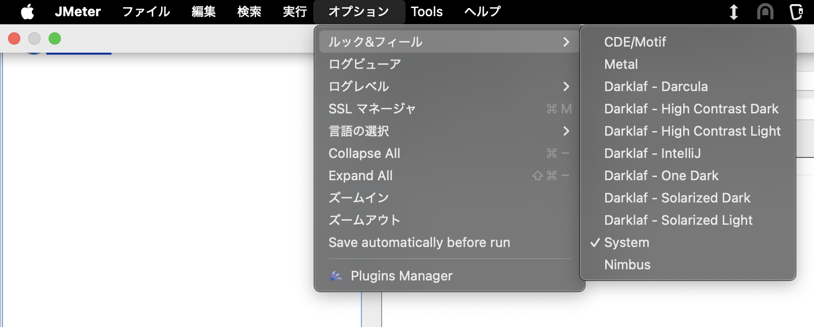

---

## 3. シナリオ作成 (Scenario Design)

本章では、JMeterで負荷試験をするために、シナリオを作成する方法を記述する。  
なお、JMeterのシナリオファイル(.jmx)はXML形式であり、競合時のマージが困難のためバージョン管理(Git)が推奨される。

> **Warning:** レポートファイル（.jtl, .html）やログファイルは容量が大きくなるため、管理の場合は`.gitignore` に追加するなど対応すること。

### 3-1. プロキシレコーディング (HTTP Proxy Server)

ブラウザの操作を記録してベースとなるスクリプトを作成する。

**※ 初回実施時のみ、HTTPS通信の復号化に必要な証明書設定が必要となる。詳細は [Appendix A. プロキシとHTTPS証明書の設定詳細](#appendix-a-プロキシとhttps証明書の設定詳細) を参照のこと。**

1. **スレッドグループの作成**
   テスト計画に `Threads (Users)` -> `スレッドグループ` を追加する。

2. **記録コントローラの作成**
   スレッドグループ内に `ロジックコントローラー` -> `記録コントローラー` を追加する。

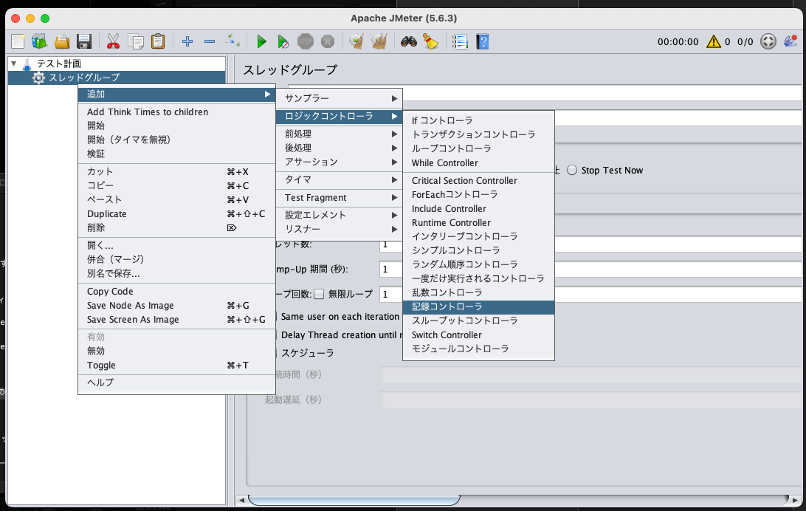

3. **HTTPプロキシサーバの設定**
   `Non-Testエレメント` -> `HTTPプロキシサーバ` を追加する。
   * **ポート:** `8888` (デフォルト)
   * **対象となるコントローラ:** 手順2で作成した記録コントローラを選択

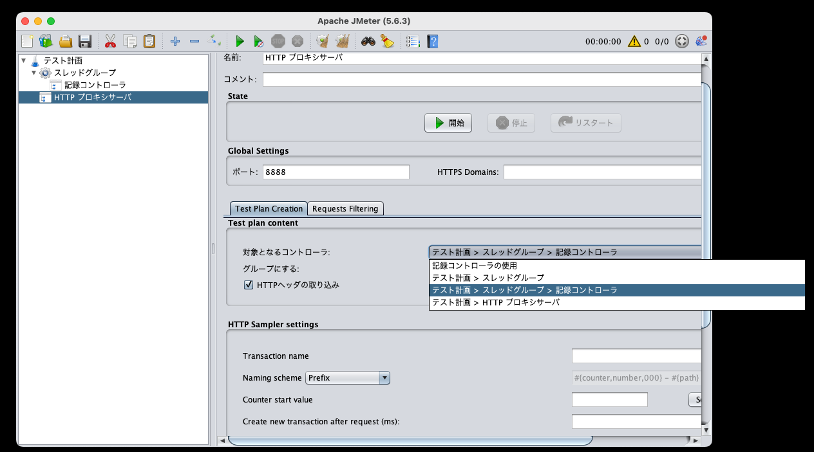

4. **フィルタリング設定 (Requests Filtering)**
   静的コンテンツ（画像、CSS、JSなど）を除外するため、「除外するパターン」に以下を設定する。

```regex
.*\.js.*
.*\.gif.*
.*\.svg.*
.*\.css.*
.*\.jpg.*
.*\.woff2.*
.*\.ico.*
.*\.png.*
.*\.woff.*
.*\.ttf.*
```

   > **Note:** 必要なドメインのみを記録する場合は「挿入するパターン」に `.*example\.com.*` のように記述する。

5. **プロキシ設定と記録開始**
   ブラウザまたはOSのプロキシ設定をJMeter（デフォルトポート: 8888）に向ける。
   [開始] ボタンを押下し、ブラウザを操作する。
   > **Note:** この時点で `ApacheJMeterTemporaryRootCA.crt` がbinフォルダに生成される。証明書エラーが出る場合は [Appendix A](#appendix-a-プロキシとhttps証明書の設定詳細) を確認すること。

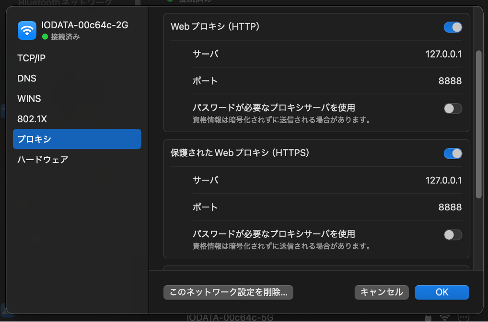

6. **不要なリクエストの整理**
   記録終了後、不要なリクエストを削除し、トランザクション名をわかりやすい名前に変更する。

   > **Note:** もし不要なリクエストが大量に存在する場合は、`4. フィルタリング設定 (Requests Filtering)`に戻り、「除外するパターン」に設定を追加することを推奨する。

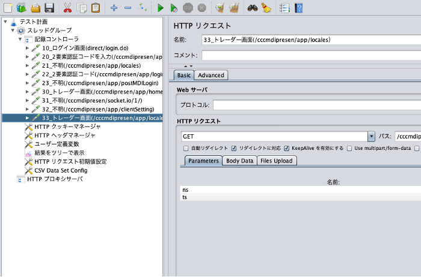

7. **動作確認**
   `リスナー` -> `結果をツリーで表示` を追加し、再生ボタンで動作を確認する。


### 3-2. アサーションと画面表示確認 (検証)

設定したシナリオにより想定された挙動をしているか、レスポンスや画面を確認する。

#### アサーション
レスポンスが正しく返ってきているか、HTTPステータスコードだけでなく中身で検証する。

1. 検証したいリクエストに対し `アサーション` -> `アサーション` を追加する。

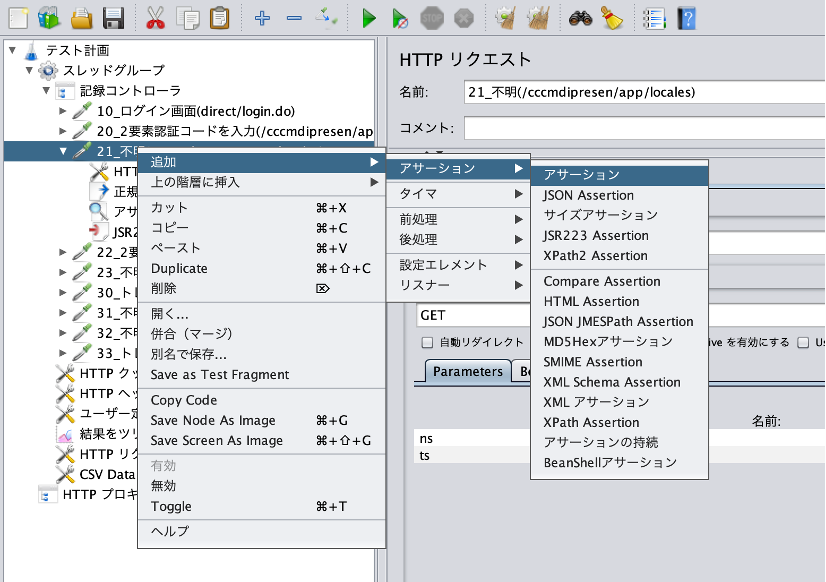

2. 「テストするパターン」に、成功時に必ず含まれるユニークな文字列（例: "ログインしました"）や固有の値（アカウント名やidなど）を設定する。

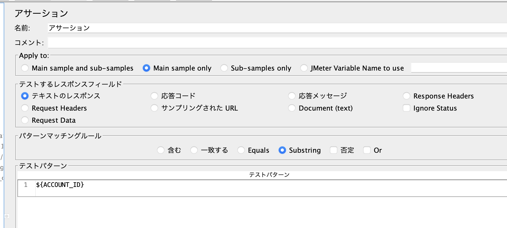

アサーションによる失敗例

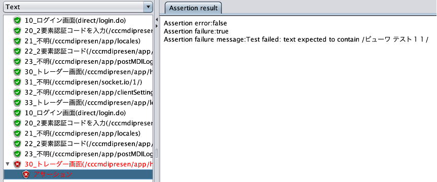

#### 実際の画面表示の確認 (HTML Debugging)
JMeterはブラウザではないため、JavaScriptを描画しない。「結果をツリーで表示」リスナーで、以下の手順でHTMLを確認する。

1.  リスナー内の `Response Data` タブを選択する。
2.  下部のプルダウンメニューから `Text` ではなく **`HTML (download resources)`** を選択する。
3.  これにより、画像やCSSを含めた「ユーザーが見る実際の画面」に近い状態でレンダリング結果を確認できる。

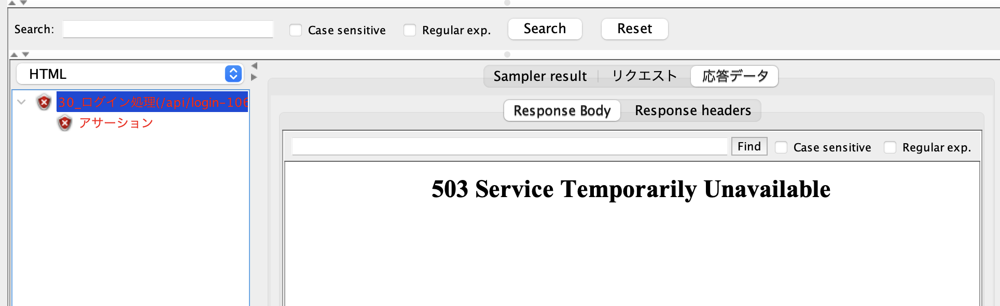

### 3-3. 動的パラメータの処理 (Correlation)

セッションIDやCSRFトークンなど、動的に変わる値をサーバーから取得して引き継ぐ設定を行う。

1. **Cookieの管理**
   スレッドグループに `設定エレメント` -> `HTTPクッキーマネージャ` を追加する。
   「繰り返しごとにクッキーを破棄しますか？」にチェックを入れる。

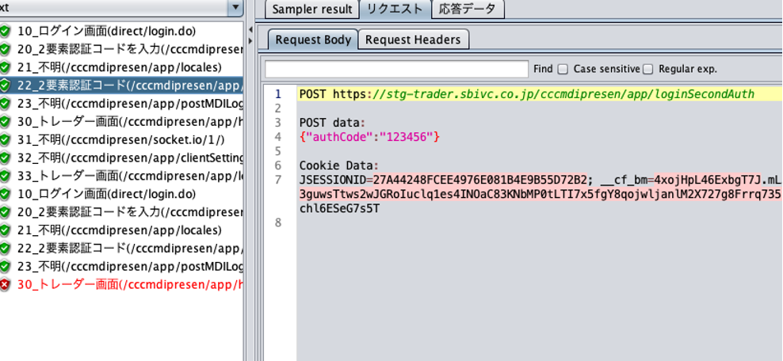

2. **値の抽出 (Extractor)**
   レスポンスから値を抽出したいリクエストに対し、後処理を追加する（例: `正規表現抽出`、または推奨される `CSS Selector Extractor`）。

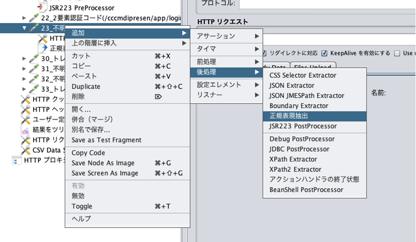

   | 項目 | 設定例 | 備考 |
   | :--- | :--- | :--- |
   | 参照名 | `widValue` | 変数名 |
   | 正規表現 | `wid=(.*?)"` | `()`の中身が抽出される |
   | テンプレート | `$1$` | |

3. **変数の利用**
   抽出した値を使用するリクエストのパラメータに `${変数名}` の形式で記述する。


4. **疎通確認**
   デバッグサンプラーやリスナーを用いて、値が正しく引き継がれているか確認する。

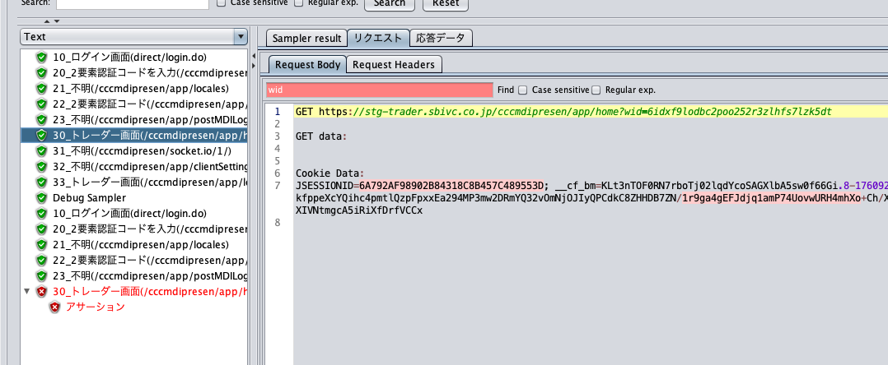

### 3-4. 外部データの利用 (CSV Data Set)

ユーザーIDやパスワードなど、テストデータを外部ファイルから読み込む。

> **Warning:** 顧客の個人情報など機密情報を使用する場合は、`.gitignore`などでGit管理対象外にすること

1. **CSVファイルの準備**
   読み込ませたいデータが入ったcsvファイルを準備する。

2. **CSV Data Set Configの設定**
   スレッドグループに `設定エレメント` -> `CSV Data Set Config` を追加する。

   以下図を参考に`CSV Data Set Config`の設定を行う。

    | 項目 | 設定内容 | 設定例 |
    | :--- | :--- | :--- |
    | Filename | 作成したCSVファイルのパスを入力する。<br>チーム間のディレクトリ構成を統一するためシナリオファイル(.jmx)からの相対パスで記述することを推奨する。 |  |
    | File encoding | ファイルのエンコーディングと一致 | UTF-8 |
    | Variable Names | 参照名をカンマ区切りで記載。Csvファイル内に記載の場合は空白 | |
    | Ignore first line (CSV) | ヘッダ行を除外するかどうか | True or False |
    | Delimiter | ファイルで使用している区切り文字を指定する。 | , |
    | Allow quoted data | ダブルクォートで囲まれているかどうか | True or False |
    | Recycle on EOF? | 全行利用した後に再利用するかどうか | True or False |
    | Stop thread EOF | 再利用しない場合、スレッドを停止させるか | True or False |
    | Sharing Mode | 複数のスレッド間でファイルを共有する（通常はこのままでOK）。 | All threads |

3. **設定した変数の利用**
    CSV Data Set Configで定義した変数をリクエストサンプラー内で使用する。

    1. データを使いたいHTTPリクエストサンプラーを開く。
    2. データ入力欄の値を以下の形式で入力する。
    入力例  
    ```
    ${login_id}, ${login_pass}
    ```


### 3-5. HTTPヘッダ設定 (Referer)
Webサイトによっては、セキュリティ対策（CSRF対策など）として Referer ヘッダのチェックを行っている場合がある。
プロキシ記録時に自動で追加されることもあるが、手動で設定が必要な場合は以下の手順で行う。

1. HTTPヘッダマネージャの追加 スレッドグループ（または特定のリクエスト）配下に 設定エレメント -> HTTPヘッダマネージャ が存在することを確認する。なければ追加する。
2. Refererの名前に Referer、値に 遷移元のURL を入力する。

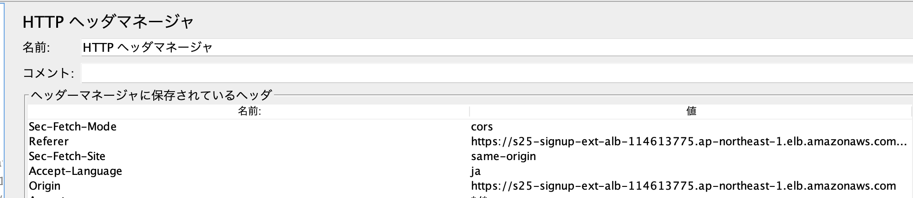

### 3-6. シナリオ動作検証とトラブルシューティング
シナリオ作成後、意図した通りに画面遷移（リクエスト）が行われない場合は、以下の観点で調査を行う。

#### 画面遷移が正常に行われない時の確認リスト
- **ブラウザでの動作確認**: JMeterではなくブラウザから手動で操作して正常に遷移できるか。
- **Cookieの受け渡し**: 3-3 の設定に基づき HTTPクッキーマネージャ が有効になっており、リクエスト間でCookieが維持されているか（リスナーの「結果をツリーで表示」等で確認）。
- **正規表現抽出の動作**: 設定した正規表現（またはCSS Selector）で値が正しく抽出され、変数に格納されているか。
- **抽出設定の不足**: 他にも正規表現抽出の設定を入れなければならない動的パラメータ（トークン等）がないか。
- **パラメータの比較**: ブラウザで遷移した時のパラメータ（開発者ツールで確認）と、JMeterで遷移した場合のパラメータに差異がないか比較したか。

#### 正規表現抽出の設定対象がわからない時のToDo
動的なパラメータを特定するための手順
1. **ブラウザでの画面遷移・パラメータ比較**: ブラウザで画面遷移を何回か行い、その時に送られているリクエストパラメータを見比べる。
2. **動的値の特定**: 同一条件で画面遷移を行なっても、パラメータの内容が変更になるものがあれば、それが正規表現抽出の対象である。
3. **入力情報の変更テスト**: ログイン情報などの入力情報を変更してみて、パラメータが変更されたものについても、設定対象の可能性が高い。
4. **確認ツール**: パラメータの確認は、ブラウザの「開発者ツール」のNetworkタブで行う。

---

## 4. 負荷試験設定 (Load Configuration)

### 4-1. スレッドグループ設定

負荷の基本量を設定する。

* **スレッド数:** 同時接続ユーザー数に相当。
* **Ramp-up期間:** 全スレッドが起動するまでの時間。
* **ループ回数:** 各スレッドがシナリオ実行を繰り返す回数の指定。テスト期間中回し続ける場合は「無限」にチェックする。

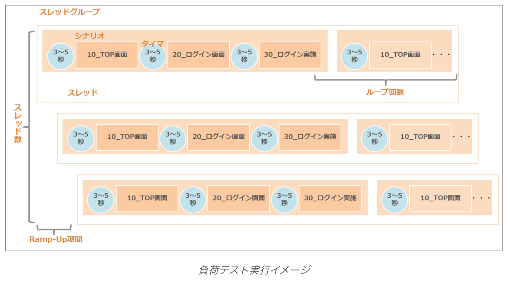


### 4-2. エラー処理
負荷試験中にエラーが発生した場合の挙動を以下の表を参考に設定する。

| 項目 | 設定内容 |
| :--- | :--- |
| 続行 | エラーを気にせずテストを続行する |
| StartNextThreadLoop | 終了し、次のループを開始する |
| スレッド停止 | 該当スレッドを停止する |
| テスト停止 | 該当テストを停止する |
| StopTestNow | 即時テストを停止する |

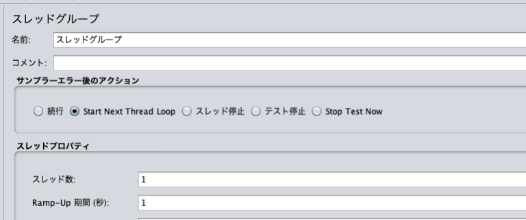

### 4-3. 思考時間 (Think Time) の設定

ユーザーが画面を見て考えている時間をシミュレートし、リクエスト間隔を調整する。

1. `タイマ` -> `一様乱数タイマ (Uniform Random Timer)` を追加する。

| 項目 | 概要 |
| :--- | :--- |
| 常数タイマ | 一定乱数を使った待ち時間設定 |
| 一様乱数タイマ | 乱数を使った待ち時間設定 |
| ガウス乱数タイマ | ガウス分布を使った待ち時間設定 |

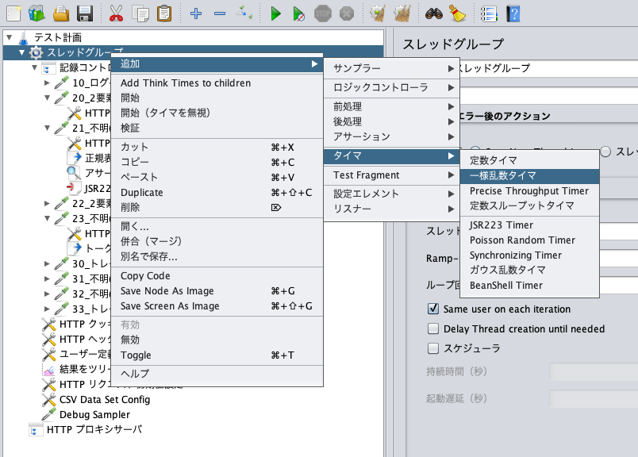

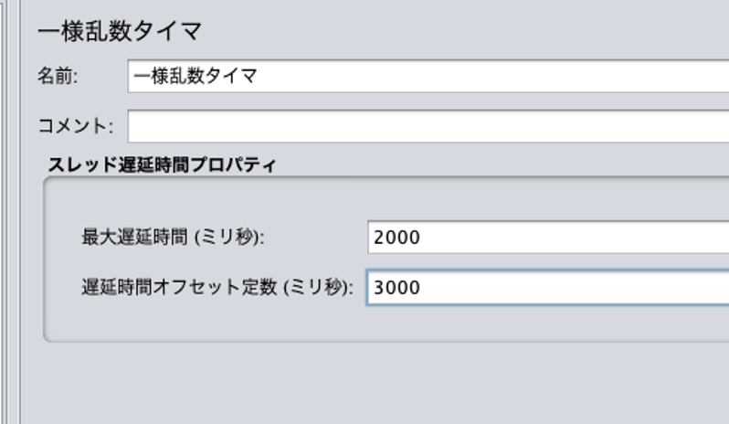

2. `リスナー` -> `結果を表で表示` などで、意図した通りの待機時間が発生しているか確認する。

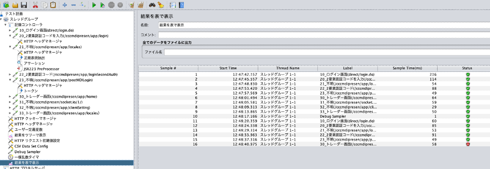

### 4-4. 目標スループットの制御 (Throughput Shaping Timer)

RPS（1秒あたりのリクエスト数）を固定したい場合に使用する。

1. `タイマ` -> `jp@gc - Throughput Shaping Timer` を追加する。

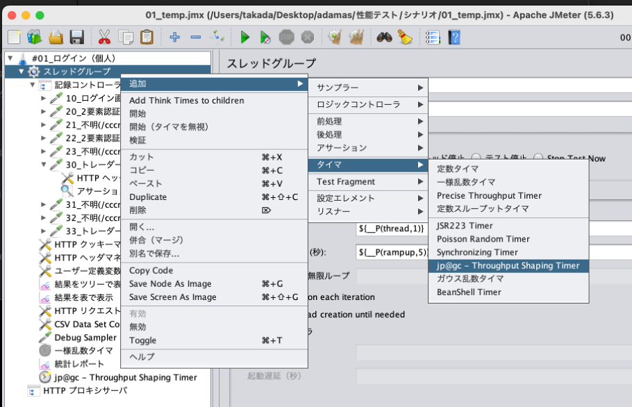

2. **負荷パターンの設定**
   「Start RPS」から「End RPS」へ、「Duration」秒かけて推移させる設定を行う。

| 項目 | 概要 |
| :--- | :--- |
| Start Throughput | 開始時の負荷量を設定する |
| End Throughput | 終了時の負荷量を設定する |
| Duration | 継続時間を設定する |

> **Warning:** RPSはリクエスト数の単位であるため、シナリオが1ループにつき3つのHTTPリクエストを送信している場合、3 RPSは1 ループ/秒となる

> **Warning:** 分散環境(=workerサーバ複数台)での実行の場合、それぞれのworkerサーバでシナリオ実行がされるため、負荷対象サーバへの負荷は`設定したRPS` * `workerサーバの数`となってしまうことに注意

3. **スレッド数の再調整**
    `Throughput Shaping Timer` (TST) で目標RPSを設定しても、**スレッド数 (N)** が不足していると、想定された負荷をかけられない。テスト実行後、結果に基づいてスレッド数を再調整する必要がある。

   > **リトルの法則 (Little's Law)**
    > 性能テストにおける適切な同時実行スレッド数 (N) は、以下の式で求められる。
    > $$N \approx RPS \times T$$
    > ここで、**RPS** は目標とする1秒あたりのリクエスト数 (Throughput)、**T** はシナリオ1ループあたりの**合計応答時間**（秒）である。
    >
    > *T* は、シナリオの平均応答時間（Think Timeを含む）を参考に算出する。この N の値よりスレッド数が小さすぎると、TSTが設定した目標RPSを達成できない。

### 4-5. スレッド数の再調整とJMeterの負荷対策

負荷を高くするためにスレッド数を調整する際、JMeter自身がボトルネックにならないよう注意が必要である。

* **JMeterサーバーの負荷確認:**
  スレッド数Nを大きくすると、JMeterを起動しているサーバー（クライアントマシン）自体の負荷（CPU使用率、メモリ使用率）が高くなる。

* **負荷増強のための対応:**
  上記のリソース確認の結果、単一のJMeterサーバーでは目標とする負荷を達成できない場合、以下の対応が必要になる。
  1. **スケールアップ:** JMeterサーバーのCPUやメモリを増強する。
  2. **スケールアウト (分散環境の構築):** JMeterの**分散環境機能**（Controller-Worker構成）を利用し、複数のマシンで負荷を分担して生成する。この機能を利用することで、単一サーバーの限界を超えた大規模な負荷試験が可能となる。

### 4-6. 本番実行前の準備

1. **リスナーの無効化**
   GUI実行用のリスナー（結果をツリーで表示など）はメモリを大量に消費するため、全て **無効化** または **削除** する。

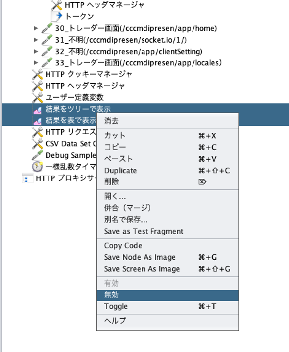

2. **変数のパラメータ化**
   スレッド数やRamp-up期間は、実行時にコマンドラインから渡せるようにプロパティ関数 `__P()` を使用する。
   例: `${__P(thread_num, 1)}`

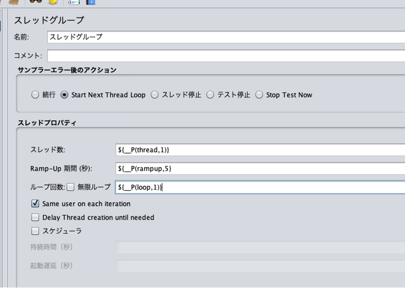

---

## 5. テスト実行 (Execution)

負荷試験は必ずCLI（Non-GUIモード）で実行する。
高負荷をかける際は、シナリオ内のリスナーを全て無効化する。

### 5-1. 実行コマンド

```bash
# 基本構文
# -n: Non-GUIモード
# -t: シナリオファイル(.jmx)
# -l: 結果ログ(.jtl)
# -e -o: HTMLレポート出力先
# -J変数名=値: プロパティの上書き

jmeter -n -t scenario.jmx -l result.jtl -e -o report_folder -Jthread_num=10 -Jramp_up=60
```

### 5-2. JMeter自体のトラブルシューティング

負荷試験実行中にJMeterがフリーズする、または強制終了する場合、以下の要因を確認する。

#### OutOfMemoryError: Java heap space
JMeterはJavaアプリケーションであり、デフォルトのメモリ設定（ヒープサイズ）は低く（例: 1GB）設定されていることが多い。高負荷時にメモリ不足で落ちる場合は、ヒープサイズを拡張する。

**対応手順 (ローカル(CLI)実行時):**
環境変数 `JVM_ARGS` でヒープサイズを指定して実行する。

```bash
# 例: 最小4GB、最大4GBのヒープを割り当てる
JVM_ARGS="-Xms4g -Xmx4g" jmeter -n -t scenario.jmx ...
```

**Linuxサーバー(worker)でのメモリ設定手順（systemd利用時）**
分散環境のワーカーサーバー（jmeter-server）を サーバー常駐(systemd) でサービス化している場合、コマンドライン引数ではなく、ユニットファイルでの環境変数設定が必要となる。

1. ユニットファイルを開く。
```bash
sudo vim /etc/systemd/system/jmeter-server.service
```
2. [Service] セクションに HEAP 環境変数を追記する。
```
# ... (既存の設定)

# メモリ割り当て設定 (Environment="HEAP=-Xms<サイズ> -Xmx<サイズ>")
# 例: c6a.xlarge (Mem 8GiB) の場合
Environment="HEAP=-Xms6g -Xmx6g"
```
3. 設定を反映し、サービスを再起動する。
```bash
sudo systemctl daemon-reload
sudo systemctl restart jmeter-server.service
```


---

## 6. レポート解析 (Result Analysis)
手順5で生成されたレポートフォルダ内の index.html をブラウザで開くと、詳細なグラフレポートが確認できる。 ここでは、性能評価において特に注目すべき指標について解説する。

### 6-1. Dashboard (概要) の見方

トップページにある（Dashboard）にある Statistics テーブルは、テスト全体の集計結果である。

| 項目 | 日本語訳 | 説明・評価ポイント |
| :--- | :--- | :--- |
| **Executions** | | |
| Samples | サンプル数 | リクエストの総数。シナリオ通りの負荷がかかったかの確認。 |
| FAIL | エラー数 | 失敗したリクエスト数。 |
| Error % | エラー率 | 全体に対する失敗の割合。 |
| **Response Times (ms)** | 応答時間 | サーバーがリクエストを受け取ってから応答を返すまでの時間。 |
| Average | 平均 | 全体の平均値。外れ値（極端に遅いリクエスト）の影響を受けやすい。 |
| **90th / 95th / 99th pct** | パーセンタイル | 例: 90th pctが 2000ms なら、「全アクセスの90%は2秒以内に完了した」ことを意味する。<br>一部の遅延を除いた実質的な体感速度を表す。 |
| Max | 最大値 | 最も遅かったリクエストの時間。スパイク（一時的な詰まり）の有無を確認する。 |
| Transactions/s | スループット | 1秒間に処理されたリクエスト数 (RPS)。<br>目標とする負荷（例: 100 RPS）が出ているか確認する。 |

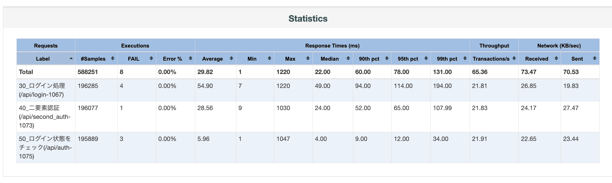

### 6-2. 重要なグラフ (Charts)

左メニューの `Charts` から、時間の経過に伴う性能変化を確認する。

#### 1. Response Time Over Time (応答時間の推移)
* **場所:** `Charts` -> `Over Time` -> `Response Time Over Time`
* **見るべきポイント:**
    * テスト後半にかけてグラフが右肩上がりになっていないか？（メモリリークやDB詰まりの兆候）
    * 特定の時間帯にスパイク（急激な跳ね上がり）がないか？（GC発生やAuto Scalingの遅れなど）

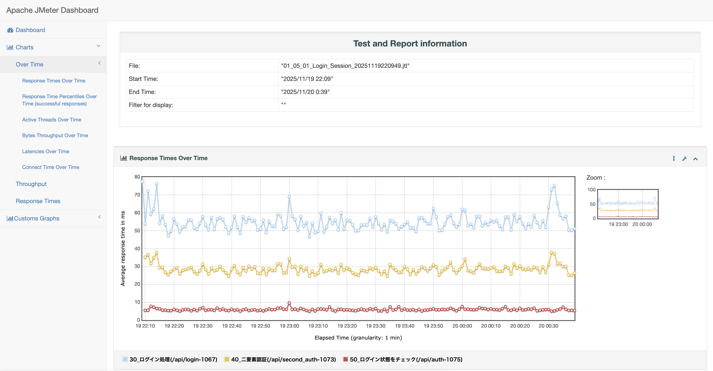

#### 2. Transactions Per Second (スループットの推移)
* **場所:** `Charts` -> `Throughput` -> `Transactions Per Second`
* **見るべきポイント:**
    * 設定した負荷（RPS）通りにリクエストが送信され、処理されているか。
    * 応答時間の悪化と共にスループットが低下していないか（システム限界の到達）。

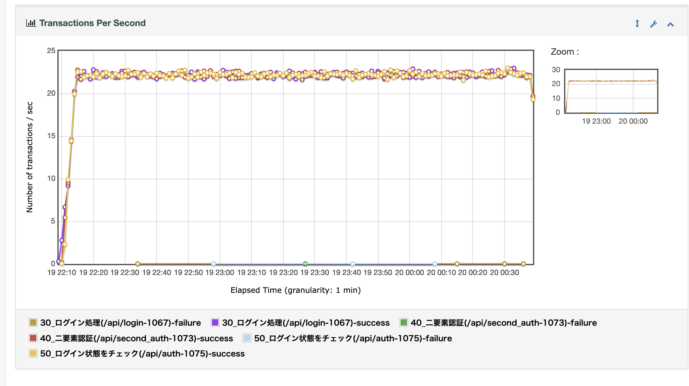

#### 3. Active Threads Over Time (同時接続数の推移)
* **場所:** `Charts` -> `Over Time` -> `Active Threads Over Time`
* **見るべきポイント:**
    * 設定したスレッド数通りに推移しているか。
    * エラー発生時にスレッドが異常終了して減っていないか。

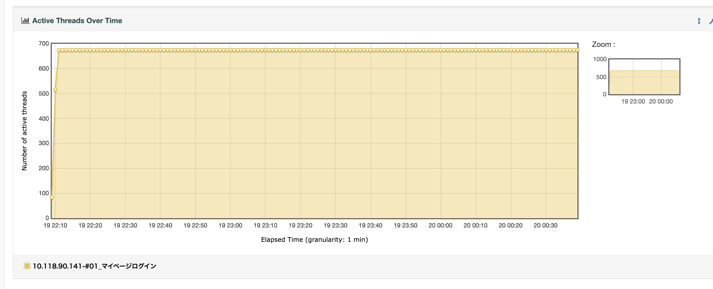

---
## Appendix A. プロキシとHTTPS証明書の設定詳細

JMeterでHTTPSサイト（暗号化された通信）をキャプチャするためには、JMeterが発行する「自己署名証明書」をPCに信頼させる必要がある。
これを行わない場合、ブラウザで「この接続はプライバシーが保護されていません」等のエラーが出て先に進めない。

### A-1. 証明書の生成

1. JMeterの「HTTPプロキシサーバ」で [開始] ボタンを押す。
2. 以下のダイアログが表示される。
   > CA certificate ... Created in JMeter bin directory
3. JMeterの `bin` ディレクトリ（`/libexec/bin` 等）に `ApacheJMeterTemporaryRootCA.crt` というファイルが生成される。
   **有効期限は7日間** であるため、期限切れの際は再生成と再インストールが必要になる。

### A-2. 証明書のインストール (MacOS / Chromeの場合)

Chromeは、OS（Mac）のキーチェーン設定を参照する。

1. 生成された `ApacheJMeterTemporaryRootCA.crt` をダブルクリックする。
2. 「キーチェーンアクセス」が開くので、ログインキーチェーンに追加する。
3. 追加された証明書（JMeter Root CA）をダブルクリックする。
4. **「信頼 (Trust)」** セクションを開き、「この証明書を使用するとき」を **「常に信頼 (Always Trust)」** に変更する。

### A-3. macOSネットワークプロキシの設定

ブラウザ（Chrome/Safari）の通信をJMeter経由にするため、OSのネットワーク設定を変更する。


1. **設定画面を開く**
   `システム設定` -> `ネットワーク` -> `Wi-Fi`（有線の場合はEthernet） -> `詳細...` をクリックする。
2. **プロキシタブの選択**
   左側のメニューから `プロキシ` を選択する。
3. **HTTPとHTTPSの設定**
   以下の2項目をスイッチを **ON** にし、それぞれ設定する。
   * **Webプロキシ (HTTP)**
     * サーバ: `localhost`
     * ポート: `8888`
   * **保護されたWebプロキシ (HTTPS)**
     * サーバ: `localhost`
     * ポート: `8888`


4. **設定の適用（重要）**
   [OK] をクリックして詳細画面を閉じた後、ネットワーク設定画面右下の **[適用] ボタンを必ずクリックする**。これを行わないと設定が反映されない。
   > **Warning:** 記録終了後は、必ず上記2つのプロキシ設定を **OFF** に戻し、再度 [適用] すること。戻し忘れるとインターネットに繋がらなくなる。

### A-4. トラブルシューティング

* **Q. キャプチャが始まらない / サイトにつながらない**
  * **A1.** JMeterのプロキシサーバが [開始] 状態になっているか確認する。
  * **A2.** ブラウザのプロキシ設定が `localhost` : `8888` になっているか確認する。

* **Q. "Your connection is not private" エラーが消えない**
  * **A.** 証明書の有効期限（7日）が切れている可能性がある。JMeterのbinフォルダにある `crt` ファイルと `proxyserver.jks` を削除し、JMeterを再起動してプロキシを開始（再生成）した後、再度インストール手順を行う。

---

## Appendix B. メール取得機能 (Mail Reader Sampler)

会員登録やパスワードリセットなど、メールで送られてくる「認証コード」や「URL」をテスト内で取得する場合、JMeter標準の **Mail Reader Sampler** を使用する。

### B-1. 前提条件: Googleアカウントの設定 (Gmailの場合)
通常のGmailパスワードでは、セキュリティ設定（2段階認証など）によりIMAP接続が拒否される場合が多い。必ず **アプリパスワード** を生成して使用すること。

1. Googleアカウント管理画面へアクセスする。
2. セキュリティ設定から「アプリパスワード」を生成する。
   * 参考: [アプリ パスワードでログインする - Google アカウント ヘルプ](https://support.google.com/accounts/answer/185833)
3. 生成された16桁のパスワードを控えておく（これがJMeter設定時のパスワードになる）。

### B-2. メールサーバー接続設定 (Troubleshooting)
接続時に `No appropriate protocol` エラーが出る場合、JMeterが古い暗号化方式を使おうとしている可能性がある。以下の設定を行う。

1. JMeterの `bin` ディレクトリにある `system.properties` をエディタで開く。
2. 末尾に以下の行を追加して保存し、JMeterを再起動する。
   ```properties
   mail.imaps.ssl.protocols=TLSv1.2 TLSv1.3
    ```
### B-3. Mail Reader Sampler の設定手順

1. **サンプラーの追加**
   スレッドグループに対し、`サンプラー` -> `Mail Reader Sampler` を追加する。

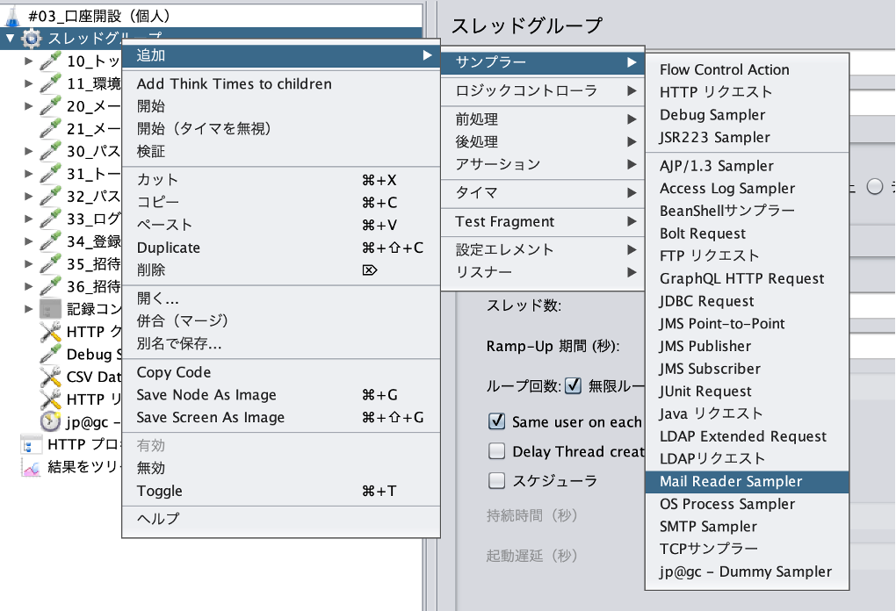

2. **接続情報の入力**
   Gmailを受信する場合の標準的な設定は以下の通り。

   | 項目 | 設定値 | 備考 |
   | :--- | :--- | :--- |
   | Protocol | `imaps` | 安全な接続(SSL)を使用 |
   | Server Host | `imap.gmail.com` | |
   | Port | `993` | |
   | Username | `your_email@gmail.com` | テスト用アドレス |
   | Password | `${__P(mail_pass)}` | **手順B-1で取得したアプリパスワード** |
   | Folder | `INBOX` | 受信トレイ |
   | Number of messages | `1` | 最新の1件のみ取得 |

> **Note:** `${__P(mail_pass)}`については実行時にコマンドライン引数 -Jmail_pass=アプリパスワード で渡すこと

3. **セキュリティ設定**
   * 「Enforce StartTLS」はチェック不要（imapsプロトコルを使用するため）。
   * 「Trust All Certificates」にはチェックを入れる（証明書エラー回避のため）。

### B-4. メール本文からのデータ抽出

メール本文から「認証コード」などを抜き出すには、後処理（PostProcessor）を使用する。

#### 方法A: 正規表現抽出（推奨・簡単）

1. Mail Reader Sampler の子要素に `後処理` -> `正規表現抽出` を追加する。
2. 以下の例を参考に設定する。
   * **Apply to:** Main sample only
   * **Field to check:** Body
   * **正規表現:** `コード: (\d{6})` ※メール本文の形式に合わせる
   * **テンプレート:** `$1$`
   * **参照名:** `verification_code`

#### 方法B: JSR223 PostProcessor (Groovy)
複雑な条件（例：件名でフィルタリングしたい、特定のHTMLタグの中身が欲しい等）がある場合は、スクリプトを使用する。

1. Mail Reader Sampler の子要素に `後処理` -> `JSR223 PostProcessor` を追加する。
2. 言語に `groovy` を選択し、スクリプトを記述する。

スクリプトの例
```groovy
// レスポンス（メール本文）を文字列として取得
String emailBody = prev.getResponseDataAsString();

// 正規表現で6桁の数字を探す例
def matcher = (emailBody =~ /([0-9]{6})/);

if (matcher.find()) {
    // 見つかった場合、変数 "verification_code" に格納
    vars.put("verification_code", matcher[0][1]);
    log.info("Code found: " + matcher[0][1]);
} else {
    log.warn("Code not found in email.");
}
```

### B-5. 取得した値の利用
抽出・格納された変数は、以降のHTTPリクエストのパラメータとして利用できる。

* **利用例:** 認証画面へのPOSTリクエスト
    * パラメータ名: `code`
    * 値: `${verification_code}`

---


