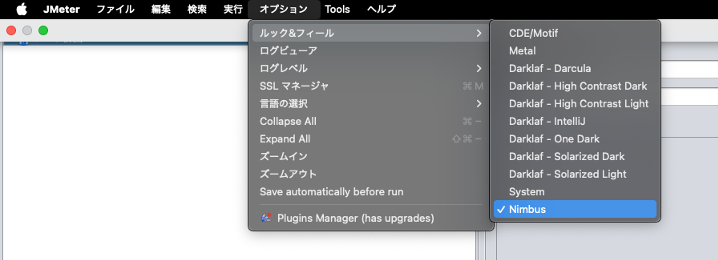
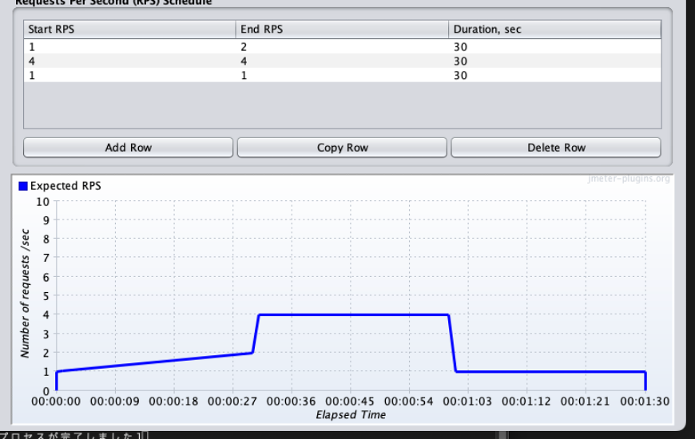
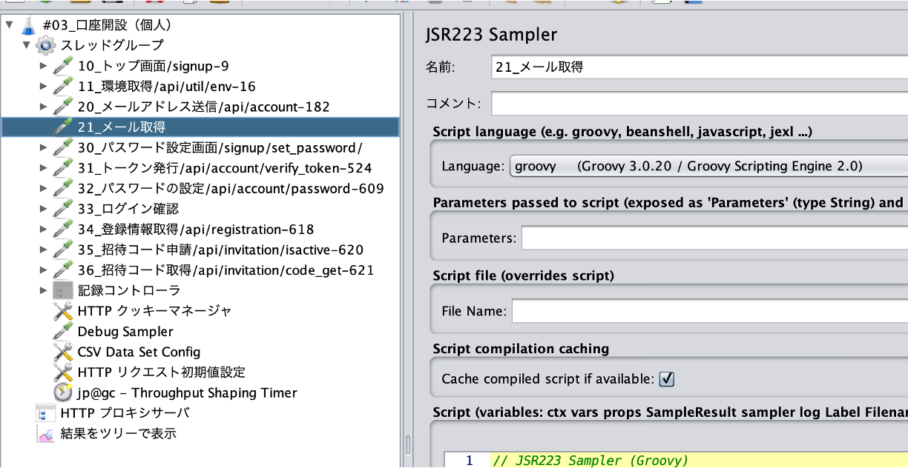

# JMeterシナリオ作成・実行手順書

## 目次
1. [はじめに](#1-はじめに)
2. [環境構築 (Setup)](#2-環境構築-setup)
3. [シナリオ作成 (Scenario Design)](#3-シナリオ作成-scenario-design)
4. [負荷試験設定 (Load Configuration)](#4-負荷試験設定-load-configuration)
5. [テスト実行 (Execution)](#5-テスト実行-execution)
6. [Appendix A. プロキシとHTTPS証明書の設定詳細](#appendix-a-プロキシとhttps証明書の設定詳細)
7. [Appendix B. メール取得機能 (IMAP)](#appendix-b-メール取得機能-imap)

## 1. はじめに
本ドキュメントは、負荷試験におけるJMeterのセットアップ、シナリオ作成、および実行手順をまとめたものである。

### 1-1. JMeter概要
Apache JMeterは、Webアプリケーション等のパフォーマンス測定と負荷テストを行うためのオープンソースソフトウェア（Java製）である。

* **主な機能:**
    * **負荷生成:** 静的・動的なリソース（Web, API, DB等）に対し、大量の同時アクセスをシミュレートする。
    * **性能測定:** スループット（RPS）、応答時間（Latency）、エラー率などを計測する。
    * **拡張性:** プラグインにより、機能やグラフ表示を拡張可能。

## 2. 環境構築 (Setup)

### 2-1. インストールと日本語化

1. **Javaのインストール**
   JMeterの実行にはJava環境（JDK）が必要である。未導入の場合はインストールする。

2. **JMeterのインストール**
   ターミナルで以下のコマンドを実行する。

```bash
brew install jmeter
```

3. **日本語環境の設定（恒久対応）**
   起動スクリプトを直接編集せず、ユーザー設定ファイル(`user.properties`)に追記する。

```bash
cd $(brew --prefix jmeter)/libexec
echo "language=ja" >> bin/user.properties
echo "region=JP" >> bin/user.properties
```

### 2-2. プラグインの導入
1. [Throughput Shaping Timer ダウンロードページ](https://jmeter-plugins.org/?search=jpgc-tst)へアクセスし、最新のzipファイルをダウンロードする。
   

2. ダウンロードしたファイルを解凍し、以下を確認する。
   

3. **ライブラリの配置**
   解凍した `.jar` ファイルをJMeterのライブラリフォルダへ配置する。

```bash
cp *.jar $(brew --prefix jmeter)/libexec/lib/
cp ext/*.jar $(brew --prefix jmeter)/libexec/lib/ext/
```

4. **起動確認**
   JMeterを起動する。
   

5. **GUI設定**
   `オプション` → `ルック＆フィール` から **System** を選択する（推奨）。
   

---

## 3. シナリオ作成 (Scenario Design)

### 3-1. プロキシレコーディング (HTTP Proxy Server)

ブラウザの操作を記録してベースとなるスクリプトを作成する。

**※ 初回実施時のみ、HTTPS通信の復号化に必要な証明書設定が必要となる。詳細は [Appendix A. プロキシとHTTPS証明書の設定詳細](#appendix-a-プロキシとhttps証明書の設定詳細) を参照のこと。**

1. **スレッドグループの作成**
   テスト計画に `Threads (Users)` -> `スレッドグループ` を追加する。

2. **記録コントローラの作成**
   スレッドグループ内に `ロジックコントローラー` -> `記録コントローラー` を追加する。
   

3. **HTTPプロキシサーバの設定**
   `Non-Testエレメント` -> `HTTPプロキシサーバ` を追加する。
   * **ポート:** `8888` (デフォルト)
   * **対象となるコントローラ:** 手順2で作成した記録コントローラを選択
   

4. **フィルタリング設定 (Requests Filtering)**
   静的コンテンツ（画像、CSS、JSなど）を除外するため、「除外するパターン」に以下を設定する。

```regex
.*\.js.*
.*\.gif.*
.*\.svg.*
.*\.css.*
.*\.jpg.*
.*\.woff2.*
.*\.ico.*
.*\.png.*
.*\.woff.*
.*\.ttf.*
```

   > **Note:** 必要なドメインのみを記録する場合は「挿入するパターン」に `.*example\.com.*` のように記述する。

5. **プロキシ設定と記録開始**
   ブラウザまたはOSのプロキシ設定をJMeter（デフォルトポート: 8888）に向ける。
   [開始] ボタンを押下し、ブラウザを操作する。
   > **Note:** この時点で `ApacheJMeterTemporaryRootCA.crt` がbinフォルダに生成される。証明書エラーが出る場合は [Appendix A](#appendix-a-プロキシとhttps証明書の設定詳細) を確認すること。
   

6. **不要なリクエストの整理**
   記録終了後、不要なリクエストを削除し、トランザクション名をわかりやすい名前に変更する。  
   > **Note:** もし不要なリクエストが大量に存在する場合は、`4. フィルタリング設定 (Requests Filtering)`に戻り、「除外するパターン」に設定を追加することを推奨する。
   

7. **動作確認**
   `リスナー` -> `結果をツリーで表示` を追加し、再生ボタンで動作を確認する。
   

### 3-2. アサーション (検証)

レスポンスが正しく返ってきているか、HTTPステータスコードだけでなく中身で検証する。

1. 検証したいリクエストに対し `アサーション` -> `アサーション` を追加する。
   

2. 「テストするパターン」に、成功時に必ず含まれるユニークな文字列（例: "ログインしました"）を設定する。
   

### 3-3. 動的パラメータの処理 (Correlation)

セッションIDやCSRFトークンなど、動的に変わる値をサーバーから取得して引き継ぐ設定を行う。

1. **Cookieの管理**
   スレッドグループに `設定エレメント` -> `HTTPクッキーマネージャ` を追加する。
   「繰り返しごとにクッキーを破棄しますか？」にチェックを入れる。
   

2. **値の抽出 (Extractor)**
   レスポンスから値を抽出したいリクエストに対し、後処理を追加する（例: `正規表現抽出`、または推奨される `CSS Selector Extractor`）。
   

   | 項目 | 設定例 | 備考 |
   | :--- | :--- | :--- |
   | 参照名 | `widValue` | 変数名 |
   | 正規表現 | `wid=(.*?)"` | `()`の中身が抽出される |
   | テンプレート | `$1$` | |

   > **Note:** 正規表現はHTML構造の変化に弱いため、可能な限り **CSS Selector Extractor** の使用を推奨する。

3. **変数の利用**
   抽出した値を使用するリクエストのパラメータに `${変数名}` の形式で記述する。
   

4. **疎通確認**
   デバッグサンプラーやリスナーを用いて、値が正しく引き継がれているか確認する。
   

### 3-4. 外部データの利用 (CSV Data Set)

ユーザーIDやパスワードなど、テストデータを外部ファイルから読み込む。

1. **CSVファイルの準備**
   `src/data/user.csv` などを準備する。
2. **CSV Data Set Configの設定**
   スレッドグループに `設定エレメント` -> `CSV Data Set Config` を追加する。
   

---

## 4. 負荷試験設定 (Load Configuration)

### 4-1. スレッドグループ設定

負荷の基本量を設定する。


* **スレッド数:** 同時接続ユーザー数に相当。
* **Ramp-up期間:** 全スレッドが起動するまでの時間。
* **ループ回数:** テスト期間中回し続ける場合は「無限」にチェックし、Duration（持続時間）を指定する。

### 4-2. エラー処理
負荷試験中にエラーが発生した場合の挙動を設定する。通常は「続行」または「次のループを開始する」を選択する。


### 4-3. 思考時間 (Think Time) の設定

ユーザーが画面を見て考えている時間をシミュレートし、リクエスト間隔を調整する。

1. `タイマ` -> `一様乱数タイマ (Uniform Random Timer)` を追加する。
   
   

2. `リスナー` -> `結果を表で表示` などで、意図した通りの待機時間が発生しているか確認する。
   

### 4-4. 目標スループットの制御 (Throughput Shaping Timer)

RPS（1秒あたりのリクエスト数）を固定したい場合に使用する。

1. `タイマ` -> `jp@gc - Throughput Shaping Timer` を追加する。
   

2. **負荷パターンの設定**
   「Start RPS」から「End RPS」へ、「Duration」秒かけて推移させる設定を行う。
   

### 4-5. 本番実行前の準備

1. **リスナーの無効化**
   GUI実行用のリスナー（結果をツリーで表示など）はメモリを大量に消費するため、全て **無効化** または **削除** する。
   

2. **変数のパラメータ化**
   スレッド数やRamp-up期間は、実行時にコマンドラインから渡せるようにプロパティ関数 `__P()` を使用する。
   例: `${__P(thread_num, 1)}`
   

---

## 5. テスト実行 (Execution)

負荷試験は必ずCLI（Non-GUIモード）で実行する。

### 5-1. 実行コマンド

```bash
# 基本構文
# -n: Non-GUIモード
# -t: シナリオファイル(.jmx)
# -l: 結果ログ(.jtl)
# -e -o: HTMLレポート出力先
# -J変数名=値: プロパティの上書き

jmeter -n -t scenario.jmx -l result.jtl -e -o report_folder -Jthread_num=10 -Jramp_up=60
```


---

## Appendix A. プロキシとHTTPS証明書の設定詳細

JMeterでHTTPSサイト（暗号化された通信）をキャプチャするためには、JMeterが発行する「自己署名証明書」をPCに信頼させる必要がある。
これを行わない場合、ブラウザで「この接続はプライバシーが保護されていません」等のエラーが出て先に進めない。

### A-1. 証明書の生成

1. JMeterの「HTTPプロキシサーバ」で [開始] ボタンを押す。
2. 以下のダイアログが表示される。
   > CA certificate ... Created in JMeter bin directory
3. JMeterの `bin` ディレクトリ（`/libexec/bin` 等）に `ApacheJMeterTemporaryRootCA.crt` というファイルが生成される。
   **有効期限は7日間** であるため、期限切れの際は再生成と再インストールが必要になる。

### A-2. 証明書のインストール (MacOS / Chromeの場合)

Chromeは、OS（Mac）のキーチェーン設定を参照する。

1. 生成された `ApacheJMeterTemporaryRootCA.crt` をダブルクリックする。
2. 「キーチェーンアクセス」が開くので、ログインキーチェーンに追加する。
3. 追加された証明書（JMeter Root CA）をダブルクリックする。
4. **「信頼 (Trust)」** セクションを開き、「この証明書を使用するとき」を **「常に信頼 (Always Trust)」** に変更する。

### A-3. macOSネットワークプロキシの設定

ブラウザ（Chrome/Safari）の通信をJMeter経由にするため、OSのネットワーク設定を変更する。


1. **設定画面を開く**
   `システム設定` -> `ネットワーク` -> `Wi-Fi`（有線の場合はEthernet） -> `詳細...` をクリックする。
2. **プロキシタブの選択**
   左側のメニューから `プロキシ` を選択する。
3. **HTTPとHTTPSの設定**
   以下の2項目をスイッチを **ON** にし、それぞれ設定する。
   * **Webプロキシ (HTTP)**
     * サーバ: `localhost`
     * ポート: `8888`
   * **保護されたWebプロキシ (HTTPS)**
     * サーバ: `localhost`
     * ポート: `8888`
    
4. **設定の適用（重要）**
   [OK] をクリックして詳細画面を閉じた後、ネットワーク設定画面右下の **[適用] ボタンを必ずクリックする**。これを行わないと設定が反映されない。
   > **Warning:** 記録終了後は、必ず上記2つのプロキシ設定を **OFF** に戻し、再度 [適用] すること。戻し忘れるとインターネットに繋がらなくなる。

### A-4. トラブルシューティング

* **Q. キャプチャが始まらない / サイトにつながらない**
  * **A1.** JMeterのプロキシサーバが [開始] 状態になっているか確認する。
  * **A2.** ブラウザのプロキシ設定が `localhost` : `8888` になっているか確認する。

* **Q. "Your connection is not private" エラーが消えない**
  * **A.** 証明書の有効期限（7日）が切れている可能性がある。JMeterのbinフォルダにある `crt` ファイルと `proxyserver.jks` を削除し、JMeterを再起動してプロキシを開始（再生成）した後、再度インストール手順を行う。


---

## Appendix B. メール取得機能 (IMAP)

メール認証などのフローが必要な場合、`JSR223 Sampler` を使用してIMAP接続を行う。

1. **JSR223 Samplerの追加**
   言語に `groovy` を選択する。
   

2. **ライブラリの確認**
   `javax.mail.jar` がlib配下に存在することを確認する。

3. **スクリプトの実装**
   Gmail等のIMAPサーバーへ接続し、件名や宛先でメールを検索するスクリプトを記述する。
   (参考: `Mail Reader Sampler` を使う方法もあるが、柔軟な検索にはGroovyスクリプトが推奨される)
   